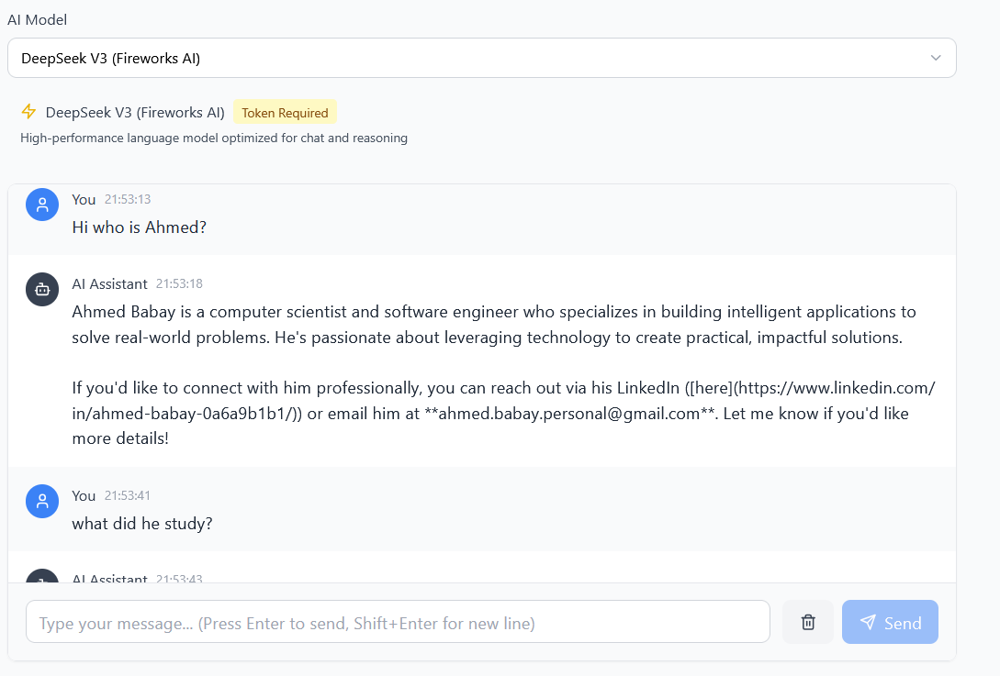
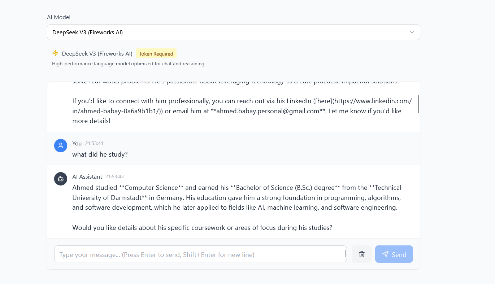

# Ahmed's Personal AI Assistant 🚀

A personalized AI chatbot powered by **RAG (Retrieval-Augmented Generation)** that answers questions about Ahmed Babay using open-source AI models. Built with React, TypeScript, Node.js, and powered by Hugging Face's models with vector similarity search.

## Screenshot




##  Features

- **🧠 RAG System**: Retrieval-Augmented Generation using vector embeddings and cosine similarity
- **🤖 Multiple AI Models**: Support for DeepSeek V3, Llama 3.1 (8B & 70B), and Mistral 7B
- **🔍 Semantic Search**: Uses sentence-transformers/all-MiniLM-L6-v2 for intelligent document retrieval
- **💬 Personalized Responses**: Answers questions about Ahmed using a custom knowledge base
- ** Vector Database**: Custom in-memory vector store with JSON persistence
- ** Cosine Similarity**: Advanced vector similarity search for relevant context retrieval
- ** Modern UI**: Beautiful, responsive design built with Tailwind CSS
- **🔒 Secure**: Rate limiting, CORS protection, and input validation
- **📱 Responsive**: Works perfectly on desktop, tablet, and mobile devices
- **⚡ Fast**: Built with Vite for lightning-fast development and builds
- **🔄 Model Switching**: Easily switch between different AI models
- **📝 Conversation History**: Maintains context across messages

## 🛠️ Tech Stack

### Frontend
- **React 18** - Modern React with hooks and functional components
- **TypeScript** - Type-safe development
- **Vite** - Fast build tool and dev server
- **Tailwind CSS** - Utility-first CSS framework
- **Lucide React** - Beautiful, consistent icons
- **React Router** - Client-side routing

### Backend
- **Node.js** - JavaScript runtime
- **Express.js** - Web framework
- **Axios** - HTTP client for API calls
- **Hugging Face API** - Access to open-source AI models (DeepSeek V3, Llama 3.1, Mistral 7B)
- **sentence-transformers/all-MiniLM-L6-v2** - Embedding model for vector generation (384-dimensional)
- **Custom Vector Store** - In-memory vector database with JSON persistence
- **Cosine Similarity** - Vector similarity algorithm for semantic search
- **Helmet** - Security middleware
- **CORS** - Cross-origin resource sharing
- **Rate Limiting** - API abuse prevention

### RAG System
- **Vector Embeddings** - Text-to-vector conversion using HuggingFace transformers
- **Similarity Search** - Cosine similarity for finding relevant documents
- **Context Injection** - Dynamic prompt enhancement with retrieved information
- **Knowledge Base** - Personal information stored as embeddings in JSON format

## 🚀 Quick Start

### Prerequisites
- Node.js 18+ 
- npm or yarn
- Git

### 1. Clone the Repository
```bash
git clone https://github.com/ahmed-babay/chat-bot.git
cd modern-chatbot
```

### 2. Install Dependencies
```bash
# Install all dependencies (root, server, and client)
npm run install:all
```

### 3. Environment Setup
Create a `.env` file in the `server` directory:

```bash
cd server
cp env.example .env
```

Edit the `.env` file with your configuration:

```env
# Server Configuration
PORT=5000
NODE_ENV=development
CLIENT_URL=http://localhost:5173

# Hugging Face Configuration
HF_API_URL=https://router.huggingface.co/v1/chat/completions
HF_MODEL=deepseek-ai/DeepSeek-V3-0324:fireworks-ai
HF_TOKEN=your_huggingface_token_here

# Model Parameters
MAX_TOKENS=500
TEMPERATURE=0.7
TOP_P=0.9
```

**Note**: Get your HuggingFace token from [https://huggingface.co/settings/tokens](https://huggingface.co/settings/tokens) - it's free and only requires "Read" access.

### 4. Set Up Your Personal Knowledge Base (RAG)

Add your personal information to the vector store:

```bash
cd server

# Edit the script with your information
# Open: server/scripts/setup-my-info.js
# Add facts about yourself, education, skills, projects, etc.

# Run the setup script (only needed once, or when updating info)
node scripts/setup-my-info.js
```

This will:
- Convert your information into vector embeddings (384-dimensional)
- Store them in `server/data/documents.json`
- Enable the chatbot to answer questions about you

**Example information to add:**
```javascript
await vectorStore.addDocument(
  "Your name is a software engineer specializing in AI",
  { category: "about_me", tags: ["career", "identity"] }
);
```

### 5. Start Development Servers
```bash
# Start both frontend and backend in development mode
npm run dev
```

This will start:
- **Backend**: http://localhost:5000
- **Frontend**: http://localhost:5173

### 6. Open Your Browser
Navigate to [http://localhost:5173](http://localhost:5173) to interact with your personalized AI assistant!

**Try asking:**
- "Who is Ahmed?"
- "What does Ahmed do?"
- "Where did Ahmed study?"
- "What programming languages does Ahmed know?"
- "Tell me about Ahmed's projects"

## 🧠 How RAG Works in This Project

This chatbot uses **Retrieval-Augmented Generation** to provide personalized responses:

1. **Question Processing**: When you ask a question (e.g., "What does Ahmed do?")
2. **Embedding Generation**: The question is converted to a 384-dimensional vector using `all-MiniLM-L6-v2`
3. **Similarity Search**: The vector store is searched using **cosine similarity** to find the most relevant documents
4. **Context Retrieval**: The top 3 most similar documents are retrieved (similarity threshold: 0.3)
5. **Prompt Enhancement**: Retrieved information is injected into the system prompt
6. **AI Response**: The LLM (DeepSeek V3 / Llama 3.1) generates a response using the provided context

**Example:**
```
User Question: "What does Ahmed do?"
    ↓
Vector Search finds (cosine similarity):
  1. "Ahmed is a computer scientist..." (0.87 similarity)
  2. "Ahmed specializes in AI..." (0.82 similarity)
  3. "Ahmed built a chatbot..." (0.71 similarity)
    ↓
Enhanced Prompt:
  "Based on this info: [retrieved docs], answer: What does Ahmed do?"
    ↓
AI Response:
  "Ahmed is a computer scientist specializing in AI and machine learning..."
```

## 🔧 Available Scripts

### Root Directory
```bash
npm run dev          # Start both frontend and backend
npm run server:dev   # Start only backend
npm run client:dev   # Start only frontend
npm run build        # Build frontend for production
npm run start        # Start production server
npm run install:all  # Install all dependencies
```

### Server Directory
```bash
cd server
npm run dev          # Start with nodemon (development)
npm start            # Start production server
npm test             # Run tests
```

### Client Directory
```bash
cd client
npm run dev          # Start Vite dev server
npm run build        # Build for production
npm run preview      # Preview production build
npm run lint         # Run ESLint
```

## 🔌 API Endpoints

### Chat
- `POST /api/chat` - Send message and get AI response with RAG
  - Parameters: `message`, `conversationHistory`, `model`, `useRAG` (default: true)
  - Returns: `response`, `model`, `rag` (contains retrieved sources and similarity scores)
- `GET /api/chat/models` - Get available AI models

### Health
- `GET /health` - Server health check

### RAG System
The vector store is automatically loaded when the server starts. Retrieved documents are logged in the console with their similarity scores.

## 🎨 Customization

### Styling
The application uses Tailwind CSS with custom color schemes. You can modify:
- `client/tailwind.config.js` - Colors, fonts, and animations
- `client/src/index.css` - Custom CSS and component styles

### AI Models
Add new models by:
1. Adding them to the `availableModels` array in `client/src/hooks/useChat.ts`
2. Updating the backend model list in `server/routes/chat.js`

### RAG System Configuration
Customize the retrieval system in `server/routes/chat.js`:
- **Number of documents**: Change `topK` parameter in `searchSimilar(message, 3, 0.3)`
- **Similarity threshold**: Adjust the `0.3` minimum threshold (0-1 scale)
- **System prompt**: Modify the prompt template to change how the AI uses context
- **Add more information**: Run `node scripts/setup-my-info.js` to update knowledge base

### Knowledge Base Management
- **Add documents**: Edit and run `server/scripts/setup-my-info.js`
- **View stored data**: Check `server/data/documents.json`
- **Clear all**: Use `vectorStore.clearAll()` in a script

### UI Components
All React components are in `client/src/components/` and can be easily customized.

## 🚀 Deployment

### Frontend (Vercel/Netlify)
```bash
cd client
npm run build
# Deploy the `dist` folder
```

### Backend (Railway/Render/Heroku)
```bash
cd server
npm start
# Set environment variables in your hosting platform
```

### Environment Variables for Production
```env
NODE_ENV=production
CLIENT_URL=https://yourdomain.com
HF_API_URL=https://api-inference.huggingface.co/models
HF_MODEL=google/gemma-2-2b-it
HF_API_TOKEN=your_production_token
```

## 🔒 Security Features

- **Rate Limiting**: Prevents API abuse
- **CORS Protection**: Secure cross-origin requests
- **Input Validation**: Sanitizes user inputs
- **Helmet**: Security headers
- **Request Size Limits**: Prevents large payload attacks

## 🧪 Testing

```bash
cd server
npm test
```

## 📁 Project Structure

```
ahmed-chatbot/
├── client/                 # React frontend
│   ├── src/
│   │   ├── components/    # React components (ChatInterface, Header, Message, ModelSelector)
│   │   ├── hooks/         # Custom React hooks (useChat)
│   │   ├── App.tsx        # Main app component
│   │   └── main.tsx       # Entry point
│   ├── public/            # Static assets
│   ├── package.json       # Frontend dependencies
│   ├── tailwind.config.js # Tailwind configuration
│   └── vite.config.ts     # Vite configuration
├── server/                 # Node.js backend
│   ├── routes/            # API routes
│   │   └── chat.js        # Chat endpoint with RAG integration
│   ├── services/          # Business logic (NEW - RAG System)
│   │   ├── embeddings.js  # Vector embedding generation (all-MiniLM-L6-v2)
│   │   └── vectorStore.js # Vector database with cosine similarity
│   ├── data/              # Data storage (NEW)
│   │   └── documents.json # Vector embeddings storage
│   ├── scripts/           # Utility scripts (NEW)
│   │   └── setup-my-info.js # Initialize knowledge base
│   ├── index.js           # Server entry point (loads vector store)
│   ├── package.json       # Backend dependencies
│   └── env.example        # Environment variables template
├── package.json            # Root package.json
└── README.md              # This file
```

## 🤝 Contributing

1. Fork the repository
2. Create a feature branch (`git checkout -b feature/amazing-feature`)
3. Commit your changes (`git commit -m 'Add amazing feature'`)
4. Push to the branch (`git push origin feature/amazing-feature`)
5. Open a Pull Request

## 📝 License

This project is licensed under the MIT License - see the [LICENSE](LICENSE) file for details.

## 🙏 Acknowledgments

- **Hugging Face** for providing access to open-source AI models and embedding models
- **Sentence Transformers** for the all-MiniLM-L6-v2 embedding model
- **DeepSeek AI** for DeepSeek V3 language model
- **Meta** for releasing Llama 3.1 models
- **Mistral AI** for Mistral 7B model
- **OpenAI** for pioneering the GPT architecture and RAG concepts

## 🆘 Troubleshooting

### Common Issues

**"Module not found" errors**
- Run `npm run install:all` to install all dependencies

**Backend won't start**
- Check if port 5000 is available
- Verify your `.env` file exists and is configured correctly

**Frontend can't connect to backend**
- Ensure backend is running on port 5000
- Check CORS configuration in server
- Verify proxy settings in `vite.config.ts`

**AI responses are slow**
- Some models take time to load on Hugging Face
- Try switching to a different model
- Check model status with `/api/chat/status/:model`

**Model requires token**
- All models in this project require Hugging Face authentication
- Get a free token from [Hugging Face](https://huggingface.co/settings/tokens)
- Add it to your `.env` file as `HF_TOKEN`

**RAG not working / No relevant documents found**
- Make sure you ran `node scripts/setup-my-info.js` to create your knowledge base
- Check that `server/data/documents.json` exists and has documents
- Verify the vector store loaded successfully (check server console logs)
- Try lowering the similarity threshold in `server/routes/chat.js` (currently 0.3)

**Embedding errors**
- Ensure your HuggingFace token has "Read" permissions
- Check internet connection (embeddings API requires online access)
- Verify `@huggingface/inference` package is installed

**AI gives generic responses instead of personalized ones**
- Make sure `useRAG: true` in the request (it's true by default)
- Check server console for RAG logs - it should show "Retrieved X documents"
- Verify your question matches information in your knowledge base
- Try asking more specific questions related to your stored information

## 📞 Support

If you encounter any issues or have questions:
1. Check the troubleshooting section above
2. Search existing GitHub issues
3. Create a new issue with detailed information
4. Join our community discussions

---

**Happy Chatting! 🤖✨**
